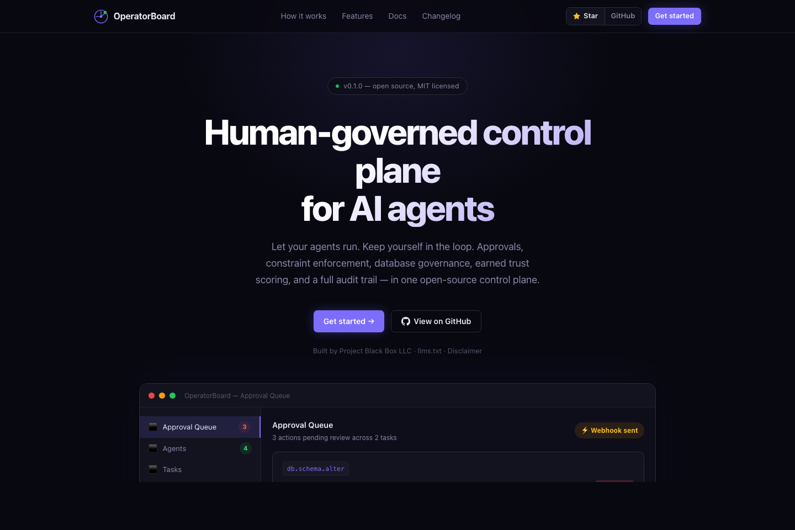

<div align="center">

# OperatorBoard

### Human-governed control plane for AI agents.

*Let your agents run. Keep yourself in the loop.*

[](https://github.com/projectblackboxllc/operatorboard/actions/workflows/ci.yml)
[](LICENSE)
[](https://www.npmjs.com/package/operatorboard)
[](package.json)
[](tsconfig.base.json)
[](apps/)

[Docs](docs/) · [Security](SECURITY.md) · [Disclaimer](DISCLAIMER.md) · [Changelog](CHANGELOG.md) · [operatorboard.dev](https://operatorboard.dev)

[](https://railway.app/new/template?template=https://github.com/projectblackboxllc/operatorboard&envs=OPERATORBOARD_API_KEY&OPERATORBOARD_API_KEYDesc=Strong+random+API+key+%28run%3A+openssl+rand+-hex+32%29)
&nbsp;&nbsp;
[](https://render.com/deploy?repo=https://github.com/projectblackboxllc/operatorboard)

<br/>

[](https://operatorboard.dev)

</div>

---

Most AI agent frameworks are **fire-and-forget**. You wire up an agent, point it at a task, and hope nothing breaks. That works in a demo. It doesn't work when the agent has keys to your database, your filesystem, or your customers' data.

**OperatorBoard** is the layer that sits between what an agent *wants* to do and what it's *allowed* to do — with a human checkpoint, a full audit trail, constraint enforcement, backup-gated destructive actions, and a trust system that widens an agent's autonomy as it earns it.

> If your agent is the employee, OperatorBoard is the compliance desk — and nothing ships without sign-off.

---

## How it works

Every agent is assigned an **execution mode** that determines what requires human review:

| Mode | Behavior |
|---|---|
| `observe` | Agent analyzes and reports. No actions taken. |
| `propose` | Every proposed action goes to the approval queue. |
| `approval_required` | Task-level approval gate. Default for new agents. |
| `scoped_autonomy` | Agent acts within an explicit constraint envelope. Violations are blocked. |

Agents start conservative. As they build a track record — high approval rate, no constraint violations — OperatorBoard computes a **trust score** and surfaces a promotion suggestion. You click the button. Trust is earned, not configured.

---

## What problem does this solve?

| Without OperatorBoard | With OperatorBoard |
|---|---|
| Agent acts immediately | Agent proposes; you approve |
| No record of what ran | Full audit trail on every action |
| "I think a backup exists" | Backup attestation required before destructive DB ops |
| Shell commands bypass DB policy | Shell DB access classified and blocked automatically |
| Network and file access on by default | Off by default; explicitly granted per task |
| High-performing agents can't earn more trust | Trust score promotes agents automatically when criteria are met |
| Webhook SSRF possible | Registration and fire-time SSRF guard on all webhook URLs |
| Token comparison timing attack | `timingSafeEqual` on all auth comparisons |

---

## Features

### Governance

- **Approval queue** — Multi-action review; task stays blocked until every action is decided
- **Execution modes** — Four-level ladder from pure observation to scoped autonomy
- **Earned trust** — Approval rate + zero-violation tracking per agent; automatic promotion suggestions at ≥90% rate, ≥5 tasks
- **Kill switch** — Suspend/resume any agent; associated tasks pause immediately
- **Task pipelines** — Completed or approved tasks can trigger a follow-on task automatically
- **Scheduled tasks** — Queue tasks for future execution with ISO 8601 scheduling
- **Org chart** — Model reporting relationships between agents; visualized as a collapsible tree
- **Cost analytics** — Spend by day, task outcomes, and approval rates across the fleet
- **Webhook notifications** — Push alerts on `approval_required`, `completed`, and approval decisions
- **Agent health checks** — Ping any agent's `/health` endpoint from the dashboard
- **Full audit trail** — Every action, approval, constraint violation, heartbeat, and integration attempt logged

### Database governance

- **Four-tier access model** — `none / read_only / write_safe / write_destructive`
- **`db.*` action namespace** — `db.query.read`, `db.row.insert`, `db.row.delete`, `db.schema.alter`, `db.backup.restore`, and more
- **Shell-bypass detection** — Shell commands containing `psql`, `mysql`, `sqlite3` auto-classified as `write_destructive` and blocked regardless of shell permissions
- **Backup attestation requirement** — Destructive DB actions blocked unless OperatorBoard independently holds a backup attestation. Agent-claimed backup references don't count.
- **Stale attestation enforcement** — Configurable `maxBackupAgeMinutes` per agent policy
- **Explicit acknowledgement gate** — `acknowledgeRisk: true` required at approval time for destructive DB actions
- **Hard gate** — Blocked actions cannot be approved. No operator bypass path.
- **Signed integration ingest** — `POST /backup-attestations/integrations/:provider` with HMAC-SHA256, provider binding, timestamp freshness, and replay protection

### Security

- **`X-Operatorboard-Key` auth** — All routes except `OPTIONS` and `/health` protected when key is configured; unkeyed deployments warned and audited
- **Timing-safe auth** — `timingSafeEqual` on all API key and signature comparisons
- **SSRF prevention** — `isSafeWebhookUrl()` blocks localhost, RFC-1918, link-local (169.254/16), and private IPv6 at registration and at every webhook fire
- **Action-type normalization** — All constraint checks lowercase and `startsWith()`-match action types, closing case-variant (`SHELL.EXEC`) and substring (`custom_shell_execution`) bypass paths
- **`allowNetwork` enforced server-side** — `http.*`, `https.*`, `network.*`, `fetch.*`, `request.*`, `socket.*`, `dns.*` blocked when networking is disabled
- **Network and file read off by default** — `allowNetwork=false`, `allowFileRead=false` in default task execution constraints
- **Approval-state guards** — Tasks in `approval_required` or `running` cannot be re-run or rescheduled; prevents silent approval queue wipes
- **Integration replay protection** — Each `provider:timestamp:signature` tuple consumed once within a 5-minute TTL; forward-dated timestamps rejected beyond 30-second clock skew
- **Attestation provenance** — `POST /backup-attestations` always sets `source: "manual"`; `source: "integration"` requires the signed path
- **Honeypot routes** — `/admin/reset`, `/.env`, `/v1/agents/register`, and similar scanner paths return 404 and log to audit trail
- **`OPERATORBOARD_ENABLE_DEV_ROUTES`** — `/dev/reset` gated behind env flag, off by default in Docker
- **Safe production defaults** — `OPERATORBOARD_SEED=false` and `OPERATORBOARD_ENABLE_DEV_ROUTES=false` in docker-compose
- **Caddy reverse proxy** — Rate limiting, scanner blocking, CSP, security headers, API key stripping from responses

---

## What OperatorBoard is not

| It is not... | What it is instead |
|---|---|
| An agent framework | A control plane you add on top of agents you already have |
| An LLM provider | It talks to your agents over HTTP; they talk to whatever LLM they want |
| A prompt manager | It governs actions, not messages |
| A security guarantee | A set of controls that reduce risk; see [DISCLAIMER.md](DISCLAIMER.md) |
| A replacement for human judgment | A tool that makes human judgment faster and better-informed |

---

## Quick start

### One-click cloud deploy

Deploy the OperatorBoard API in seconds — no terminal required:

| Platform | Notes |
|---|---|
| [](https://railway.app/new/template?template=https://github.com/projectblackboxllc/operatorboard&envs=OPERATORBOARD_API_KEY&OPERATORBOARD_API_KEYDesc=Strong+random+API+key+%28run%3A+openssl+rand+-hex+32%29) | Auto-generates API key, persistent disk, health checks wired |
| [](https://render.com/deploy?repo=https://github.com/projectblackboxllc/operatorboard) | Uses `render.yaml` blueprint — API key auto-generated |

> Full stack (API + Dashboard) on cloud: add a second service pointing at `apps/web/Dockerfile` with `NEXT_PUBLIC_API_URL` set to your API URL. For local evaluation, Docker Compose below runs both with one command.

### Docker (full stack, recommended)

```bash
# Generate a strong API key and start the full stack
export OPERATORBOARD_API_KEY=$(openssl rand -hex 32)
docker compose up

# Dashboard → http://localhost:3000
# API       → http://localhost:4100

# Include the mock agent for a full demo:
docker compose --profile demo up
```

### Local development

```bash
git clone https://github.com/projectblackboxllc/operatorboard.git
cd operatorboard
pnpm install

cp apps/api/.env.example apps/api/.env
cp apps/web/.env.example apps/web/.env
# Edit apps/api/.env — set OPERATORBOARD_API_KEY to: openssl rand -hex 32

# Start with demo seed data
OPERATORBOARD_SEED=true OPERATORBOARD_ENABLE_DEV_ROUTES=true pnpm dev

# API       → http://localhost:4100
# Dashboard → http://localhost:4300
```

---

## Architecture

```
                        ┌─────────────────────────────────┐
                        │          OperatorBoard           │
                        │                                  │
  Operator ────────────▶│  ┌──────────────┐               │
  (browser)             │  │  Next.js     │               │
                        │  │  Dashboard   │               │
                        │  │  :3000       │               │
                        │  └──────┬───────┘               │
                        │         │ REST                   │
                        │  ┌──────▼───────────────────┐   │
                        │  │  Fastify API  :4100       │   │
                        │  │  ┌──────────────────────┐ │   │
                        │  │  │ Auth · Constraints   │ │   │
                        │  │  │ Approvals · Trust    │ │   │
                        │  │  │ DB Governance · Audit│ │   │
                        │  │  └──────────────────────┘ │   │
                        │  │  SQLite · Zod · TypeScript │   │
                        │  └──────┬────────────────────┘   │
                        │         │ TaskRequest / Response  │
                        └─────────┼───────────────────────-┘
                                  │
                    ┌─────────────▼──────────────┐
                    │        Your Agents          │
                    │  (any HTTP adapter)         │
                    │  GET  /health → { ok: true }│
                    │  POST /task   → TaskResponse│
                    └─────────────────────────────┘
```

The agent protocol is deliberately minimal. Any HTTP server that implements `/health` and `/task` can register. See [`examples/mock-agent`](examples/mock-agent) for a reference implementation and [`packages/shared/src/index.ts`](packages/shared/src/index.ts) for the full Zod-validated schema.

---

## Connecting your agent

Register any HTTP agent:

```bash
curl -X POST http://localhost:4100/agents \
  -H "X-Operatorboard-Key: YOUR_KEY" \
  -H "Content-Type: application/json" \
  -d '{
    "name": "ResearchAgent",
    "role": "Researcher",
    "adapterType": "http",
    "endpoint": "http://your-agent:8080/task",
    "executionMode": "approval_required",
    "budgetLimitUsd": 10,
    "constraints": {
      "allowNetwork": false,
      "allowFileRead": false,
      "allowShell": false
    }
  }'
```

Compatible with any agent that speaks HTTP — Claude, OpenAI, Gemini, local models, or your own stack. If it can receive a task request and return proposed actions, it's in.

---

## Database governance

Before granting any agent write access to a database, read [`docs/database-governance.md`](docs/database-governance.md).

Short version: an agent can silently wipe or overwrite your database in seconds. OperatorBoard's database governance layer requires:

1. An independently-held backup attestation in the control plane (not just an agent claim)
2. Operator explicit acknowledgement at approval time
3. Stale attestation rejection based on a configurable max age

Backup attestations can be posted manually via the API or pushed automatically via a signed HMAC integration. See [`packages/agent-adapters/backup-attestor`](packages/agent-adapters/backup-attestor) for the signing library.

---

## Production deployment

See [`SECURITY.md`](SECURITY.md) for the full production checklist. The short list:

```bash
# 1. Generate a strong key
export OPERATORBOARD_API_KEY=$(openssl rand -hex 32)

# 2. Point Caddy at your domain (edit Caddyfile first)
caddy run --config Caddyfile

# 3. Verify before you go live
pnpm typecheck && pnpm test && pnpm build
```

The included [`Caddyfile`](Caddyfile) provides TLS termination, rate limiting, security headers, CSP, scanner blocking, and honeypot logging. Do not skip it.

---

## Project structure

```
operatorboard/
├── apps/
│   ├── api/                    Fastify API server
│   └── web/                    Next.js dashboard
├── packages/
│   ├── shared/                 Zod schemas (API ↔ web ↔ agents)
│   └── agent-adapters/
│       └── backup-attestor/    HMAC signing library for backup integrations
├── examples/
│   ├── mock-agent/             Reference HTTP agent implementation
│   └── backup-attestor/        Reference backup integration client
├── docs/
│   ├── database-governance.md  DB access model and approval flow
│   └── security-baseline.md    Trust model, failure modes, production minimum
├── Caddyfile                   Production reverse proxy config
├── docker-compose.yml
├── SECURITY.md                 Vulnerability reporting and known limitations
├── DISCLAIMER.md               Liability and operator responsibility
└── CHANGELOG.md
```

---

## Roadmap

### Completed in v0.1.0 ✅

- Four-level execution mode ladder
- Approval queue with multi-action support
- Earned trust scoring and promotion suggestions
- Database governance with backup attestation enforcement
- Signed backup integration ingest (HMAC-SHA256, provider binding, replay protection)
- Webhook SSRF prevention
- Action-type normalization (case-bypass and substring-evasion closed)
- Network/file access off by default
- Approval-state guards (no silent queue wipes)
- Full audit trail
- Caddy reverse proxy config
- Docker multi-stage builds
- 21-test suite across 8 suites

### On deck ⚪

- Outbound egress controls below the application layer
- Per-role action allowlists
- Audit log integrity signing
- Structured red-team test tooling for action namespace collisions
- Rate limiting on integration endpoints
- Agent-to-agent authorization model

### Considering 🔭

- Redesigned manual attestation path (stronger provenance than operator-claimed)
- Agent-supplied risk text sandboxing (currently displayed as-is in approval UI)
- Budget cross-verification (currently self-reported by agents)
- DNS-based SSRF protection at webhook fire-time

---

## FAQ

**Does OperatorBoard run my agents?**
No. It sends tasks to agents you've already built and registered. Your agents handle execution; OperatorBoard handles governance.

**What if an agent ignores the constraint envelope?**
OperatorBoard enforces constraints on the task response before any action proceeds — the agent doesn't get to decide whether its own actions are allowed. If a proposed action violates a constraint, it's blocked regardless of what the agent says.

**Can an operator approve a blocked action?**
No. Blocked actions cannot be approved. There is no override path. This is intentional.

**What if I don't set an API key?**
The API will serve unauthenticated traffic and log a warning at startup. Every unauthenticated request is audited. Set a key before going anywhere near production.

**Is this production-ready?**
v0.1.0 is a solid foundation with a serious security posture. Review [SECURITY.md](SECURITY.md) for known limitations before deploying against anything important. Read [DISCLAIMER.md](DISCLAIMER.md).

**Can I use this with Claude / GPT / Gemini / local models?**
Yes. OperatorBoard talks to agents over HTTP. Your agent can use any model it wants. We include a mock agent and backup integration examples to get you started.

---

## ⚠️ Disclaimer

OperatorBoard is a governance tool, not a guarantee. **Project Black Box LLC is not responsible for any actions taken by AI agents connected to OperatorBoard**, including data loss, unauthorized access, financial charges, or any other harm resulting from agent behavior — whether or not those actions were approved through the platform.

You are responsible for securing your deployment, understanding the capabilities of the agents you register, and applying appropriate human oversight for your context and risk tolerance.

Read the full [DISCLAIMER.md](DISCLAIMER.md) before deploying.

---

## Contributing

Issues and PRs welcome. If you're building an adapter for a specific AI framework or backup provider, the `examples/` and `packages/agent-adapters/` directories are the right places for it.

Please read [SECURITY.md](SECURITY.md) before reporting vulnerabilities — use the private reporting path, not a public issue.

---

## License

[MIT](LICENSE) — Copyright (c) 2025 [Project Black Box LLC](https://operatorboard.dev)

THE SOFTWARE IS PROVIDED "AS IS", WITHOUT WARRANTY OF ANY KIND. See [LICENSE](LICENSE) for the complete terms.
